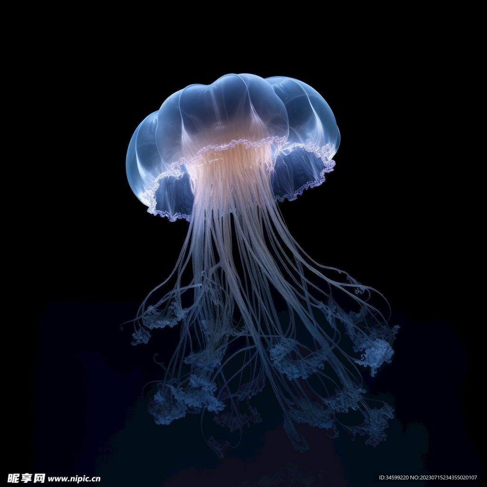

+++
title = "生命允许没有思想"
date = 2026-06-07T12:11:09+08:00
draft = false
category = "网上文案"
+++

很多人初见水母，都会被它空灵飘逸的模样打动，以为这穿梭深海的生灵，心里多少藏着几分细腻。然而生物演化史早就写下了一个冷峻的事实：这种看似灵动的生物，从头到尾，没有大脑，没有心脏，连支撑高级生命活动的骨骼也一概全无。

更让人意外的是，这种浑身 95% 都是水、软若无物的生命，竟是地球上活过了六亿年的古老元老，比恐龙登场早得多，比人类历史漫长得无法相提并论。而它熬过数次物种大灭绝的秘密，向来与思考、智慧无关。

水母属于典型的刺胞动物，身上没有高等动物赖以思考的中枢神经系统，更谈不上处理信息，产生情绪与记忆的大脑皮层。它全身只铺着一张纵横交错的弥散神经网，遍布伞体、触手与口腕，却没有一处真正的指挥中枢。它一辈子都无法整合信息，进行抽象推理，形成自我认知。它不会追问“我是谁”，也不理解自己为何游动、为何捕猎。所有对外界的回应，全是刻在基因里最本能的生理反射。

但这套“无核心”的神经体系，却是大自然一笔相当厉害的设计。人类和多数动物依赖大脑统一调度，水母反其道而行之：它身上每一处神经细胞都能独立感知水流、光线与周遭变化。伞缘藏着一种叫感觉棍的感知器官，能精准捕捉重力与环境波动，在毫秒之间调控伞体收缩，驱动身体游动。

还有一个细节值得一提：就算把水母的身体切开，散落的组织碎片依然能独自感知环境，自主游动存活。这件事，拥有集中大脑的高等生物永远办不到。

我们眼中那些像极了“聪明”的行为，背后不过是毫无思考的本能程序。触手碰见猎物，瞬间释放毒素抓捕进食，不是算计；察觉天敌或障碍，立刻转身游开，不是预判；追随光线深浅调整栖息水层，也不是权衡。亿万年来，这些动作未曾改变，不靠学习，不靠记忆，只顺着生命本能一代代传下来。

生活里一个常见的误区，便是把本能反应当作思维智慧。两者之间其实横着一条深刻的鸿沟。水母的一切行为仅由神经反射驱动，一辈子至多形成最简单的条件反射。它记不住经历，没有自我概念，也生不出喜怒哀乐。而人类与高等动物的思维，依托大脑对信息的深度加工，能思考，能创造，能共情，拥有清晰的自我认知。这便是无脑生灵与智慧生命之间最根本的界限。

即使是水母家族里神经系统最发达的箱水母，也并未跨越这条线。它长着整整二十四只眼睛，神经环也比其他同类更为聚拢，能精准绕开障碍物，主动锁定猎物，甚至表现出微弱的适应能力。但再怎么天赋异禀，它终究没有一颗真正的大脑。那些令人赞叹的表现，仍是本能支配下的结果，里头寻不见半分主观思考与意识的影子。

最后有一个真相，或许会让你重新打量这种活了六亿年的生物：水母从来不需要思想的加持。它只是一台靠弥散神经网精确运转、与海洋环境完美适配的天然生存机器。灵动飘逸的姿态，高效捕猎的本领，绝境求生的韧性，都是时间与演化赠予的本能天赋。没有思绪的纷扰，没有认知的困惑，只凭一身极致的生存适配力，它们静静悬在深海，跨越了比任何文明都漫长的时间，成为这颗星球上最古老、也最通透的生命精灵。
