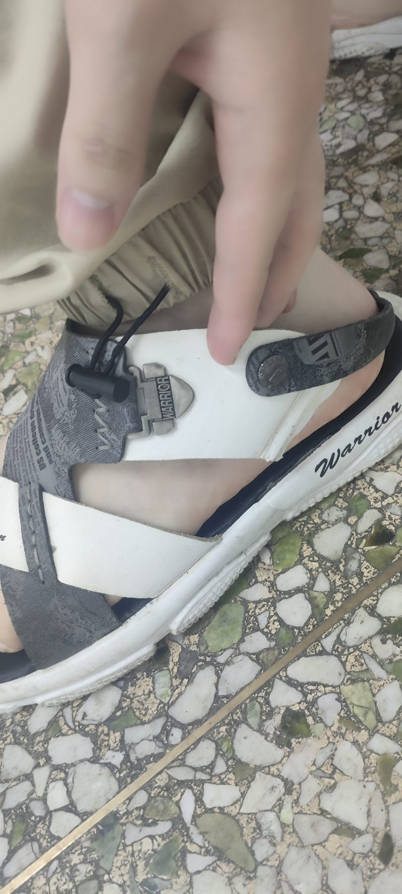

+++
title = "凉鞋断了的胡思乱想"
date = 2026-06-10T16:44:35+08:00
draft = false
category = "随感"
+++
夜色落下来的时候，正心楼里的灯火依然通明。刚下过一场雨，空气里横溢着泥土与草木洗涤后的清凉，晚风一吹，整个人都有些松快。然而没走几步，脚下一空，心里便咯噔一下——凉鞋的带子断了。
寂静的校园里，坏了的凉鞋一下一下拍打着地面，拖沓出一种叫人难堪的节奏。那一刻，路灯的影子拉得极长，我总觉得那光的尽头，每一双擦肩而过的眼睛都在隐秘地打量着我。
> **人好像总是这样。平日里穿着好鞋走在路上，从不会去留意别人的脚下。可一旦自己的鞋坏了，眼光便不由自主地寻索起来——还有谁穿着凉鞋？还有谁的鞋也像我这般狼狈？若是满眼都是完好的鞋，心里竟会生出一种莫名的愧怍，仿佛连穿凉鞋本身都成了一种过错。**
> 
其实人家或许根本没有留意，或许留意了也并不在意，只是在擦肩而过的瞬间，我总觉得他们的目光在脚边停了一停。
这种窘迫将我拽入了一种奇异的联想里。我想起曾经见过、或是想象过的那些画面：开学那天拿着边角起了毛、泛了黄的旧课本的少年，在同桌雪白、散发着油墨香的新书衬托下，局促地藏起双手；又或是穿着洗得发白、带着母亲细密针脚的二手校服，在挺括的新衣群落里走过；亦或是手里攥着一杯蜜雪冰城，走进一间人人端着星巴克的屋子。
我们总是把自己看得太重了，**以为自己是舞台中央的主角，所有人的目光都是追光灯。殊不知在别人的剧本里，我们不过是背景里一个模糊的影子，没有人会费心记住一个陌生人手里拿的什么杯子、身上穿的什么衣裳。**
**没有人会一刻不停地盯着你看，无趣、无价值、无意义、不重要——这便是那时的真相了。** 这四句话听起来有些冷清，却像是一场及时落下的雨，把人浇醒了，反倒让人松了一口气。
这样一路胡思乱想，趿拉着鞋，脚步愈发艰难，直到跌跌撞撞地回到寝室。当把那双断了带子的鞋脱下，赤脚踩在平整的地砖上时，方才一路上那些无边无际的想象和发烫的羞赧，终于戛然而止。
第二天醒来，夜雨的痕迹已被晴空拭去。我换上了一双完好无损的鞋，脚下有了底气，步履轻快了，可昨夜落下的思绪却像是在雨水里泡了一宿，在日头下翻晒出另一层更深的意思来。
当我重新穿好一双鞋，看着路上偶尔步履趔趄的人，心中竟隐隐升起一丝审视。我忽然明白，那些曾经受过困顿、一朝翻身的人，为何往往变得更加苛刻。
> **久贫乍富的人，待下往往比一直富着的人更苛刻；专升本的，有时比本科生更瞧不起专科。这不能简单地用“双标”来概括，倒像是那曾经领受过的羞赧与不安，在一朝翻身之后，悄悄地变了形状，化成了一层薄薄的优越，裹在自己身上，才觉得安全。**
> 
有人说，愤怒和恐惧原是同一种东西。触碰了痛处，有能力反击的，便成了愤怒；无力反击的，便成了恐惧。自卑是恐惧的影子，优越感则是长了力气的愤怒。自始至终，不过是人性在寻求自我保护。
这大抵就是人性的纹路吧。如同老树的年轮，溪流里的卵石，被岁月冲刷久了，自然地长成了那样，谈不上对错。
校园里依旧人来人往，昨天那场雨留下的积水已经被晒干了。我穿着完好的鞋，踩在坚实的路面上。世界依然宽阔，而我们这些凡夫俗子，就在这小小的自卑与小小的优越之间，笨拙、真实、而又有些可爱地往前走着。

